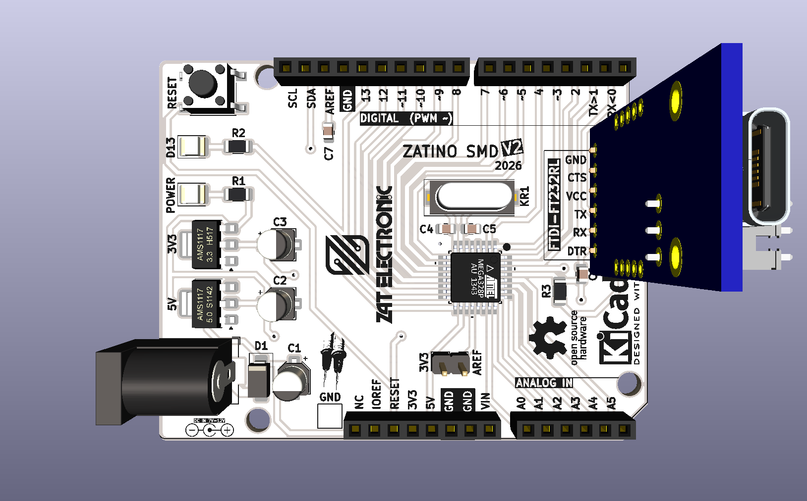
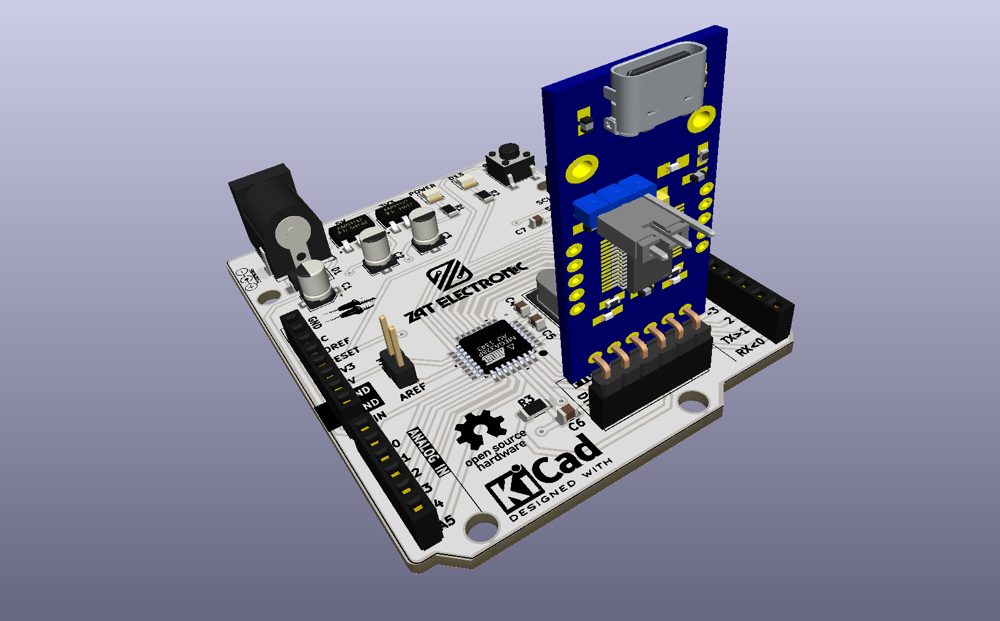

<div align="center">



# ZATINO V2 SMD

**Placa de desenvolvimento compatível com Arduino Uno, totalmente SMD, com programação USB-C integrada via módulo FT232RL**

[](https://www.kicad.org/)
[](https://www.microchip.com/en-us/product/atmega328pb)
[](https://www.oshwa.org/)
[](.)
[](.)

</div>

---

## 📋 Índice

- [ZATINO V2 SMD](#zatino-v2-smd)
  - [📋 Índice](#-índice)
  - [Visão Geral](#visão-geral)
  - [Renders 3D](#renders-3d)
  - [Funcionalidades](#funcionalidades)
  - [Especificações Técnicas](#especificações-técnicas)
  - [Lista de Materiais](#lista-de-materiais)
  - [Arquitetura de Alimentação](#arquitetura-de-alimentação)
  - [Compatibilidade de Pinos](#compatibilidade-de-pinos)
  - [Estrutura do Repositório](#estrutura-do-repositório)
  - [Como Usar](#como-usar)
    - [Abrindo no KiCad](#abrindo-no-kicad)
    - [Programando a Placa](#programando-a-placa)
  - [Sobre](#sobre)

---

## Visão Geral

**ZATINO V2 SMD** é uma placa de desenvolvimento personalizada, compatível com Arduino Uno, projetada do zero pela **ZAT ELECTRONIC** utilizando o **KICAD 10**. A placa substitui todos os componentes através-furo por componentes SMD, resultando em uma PCB mais limpa, compacta e com aparência profissional.

O projeto utiliza o **ATmega328PB-AU** (TQFP-32) como microcontrolador principal, com um módulo **FT232RL USB-C** encaixado em um conector fêmea de 6 pinos para programação serial e comunicação USB — mantendo o conector USB-C montado verticalmente na borda da placa para um acabamento elegante.

> 💡 Esta placa mantém **total compatibilidade de pinos com o Arduino Uno R3**, permitindo o uso de shields e bibliotecas existentes sem qualquer modificação.

---

## Renders 3D

<div align="center">


*Vista superior — posicionamento dos componentes e serigrafias*

<br/>



*Vista isométrica — módulo FT232RL USB-C e montagem geral da placa*

</div>

---

## Funcionalidades

- ✅ **ATmega328PB-AU** — encapsulamento SMD TQFP-32, 100% compatível com Arduino Uno
- ✅ **Programação via USB-C** pelo módulo FT232RL (conector plugável)
- ✅ **Duplo regulador de tensão** — 5V (AMS1117-5.0) e 3,3V (AMS1117-3.3)
- ✅ **Proteção contra inversão de polaridade** via diodo 1N4007 na entrada de alimentação
- ✅ **Oscilador a cristal de 16 MHz** (encapsulamento SMD HC-49/SD)
- ✅ **Pinout completo Arduino Uno R3** — conectores Digital, Analógico, Alimentação e ICSP
- ✅ **LEDs de status** (footprint SMD 1210)
- ✅ **Botão de reset tátil** (SMD 6×6×5 mm)
- ✅ **Entrada de alimentação Barrel Jack (P4)** com chave integrada
- ✅ **Projetado com KICAD 10** — EDA totalmente open source
- ✅ **Logotipo Open Source Hardware** certificado na PCB

---

## Especificações Técnicas

| Parâmetro | Valor |
|-----------|-------|
| **Microcontrolador** | ATmega328PB-AU (TQFP-32) |
| **Velocidade de Clock** | 16 MHz (cristal externo) |
| **Tensão de Operação** | 5V |
| **Tensão de Entrada** | 7–12V (Barrel Jack P4) |
| **Saída 3,3V** | AMS1117-3.3 (até 800mA) |
| **Regulador 5V** | AMS1117-5.0 |
| **Interface USB** | USB-C via módulo FT232RL |
| **Pinos Digital I/O** | 14 (D0–D13), PWM em D3, D5, D6, D9, D10, D11 |
| **Entradas Analógicas** | 6 (A0–A5) |
| **Memória Flash** | 32 KB (ATmega328PB) |
| **SRAM** | 2 KB |
| **EEPROM** | 1 KB |
| **Ferramenta de Projeto** | KICAD 10.0 |
| **Versão da PCB** | V2 — 2026 |
| **Fator de Forma** | Compatível com Arduino Uno R3 |

---

## Lista de Materiais

| Ref | Componente | Valor / Parte | Encapsulamento |
|-----|-----------|--------------|----------------|
| U2 | Microcontrolador | ATmega328PB-AU | TQFP-32 |
| REGULADOR_5V1 | Regulador de Tensão 5V | AMS1117-5.0 | SOT-223 |
| REGULADOR_3V3 | Regulador de Tensão 3,3V | AMS1117-3.3 | SOT-223 |
| KR1 | Oscilador a Cristal | 16 MHz | HC-49/SD SMD |
| BARRA_DE_PINO2 | Conector FTDI | FT232RL USB-C | Fêmea 6 pinos 2,54mm |
| A2 | Referência de Pinout | Arduino Uno R3 | — |
| D1 | Diodo Retificador | 1N4007 | SMA |
| L1, L2 | LEDs de Status | LED 5MM | 1210 (3225) SMD |
| R1 | Resistor de LED | 470Ω | 1206 |
| R2 | Resistor de LED | 220Ω | 1206 |
| R3 | Resistor de Pull-up | 10KΩ | 1206 |
| C1, C2, C3 | Capacitores Eletrolíticos | 10µF | CP Elec 4×5.4 |
| C4, C5 | Capacitores de Cristal | 22pF | 0805 |
| C6, C7 | Capacitores de Bypass | 100nF | 0805 |
| CONECTOR1 | Conector de Alimentação DC | Barrel Jack P4 | Horizontal |
| BARRA_DE_PINO1 | Conector Auxiliar | 2 terminais | 2,54mm |
| TACTIL_SWITCH1 | Botão de Reset | 6×6×5mm | SMD Tátil |
| TP1 | Ponto de Teste | — | SMD |

---

## Arquitetura de Alimentação

```
VIN (Barrel Jack P4)
        │
    [1N4007]  ← Proteção contra inversão de polaridade
        │
   ┌────┴────┐
   │         │
[AMS1117-5.0]  [AMS1117-3.3]
   │         │
  +5V       +3,3V
   │
[ATmega328PB-AU]
   │
[FT232RL USB-C] ← UART TX/RX + DTR (auto-reset)
```

A placa suporta duas fontes de alimentação:
- **Barrel Jack (P4)** — entrada de 7 a 12V DC, regulada para 5V e 3,3V internamente
- **USB-C via módulo FT232RL** — 5V direto do USB, alimentando o rail VCC quando conectado

---

## Compatibilidade de Pinos

A placa expõe o **pinout completo do Arduino Uno R3**:

| Conector | Pinos |
|----------|-------|
| Digital (PWM) | D0–D13, com PWM em ~3, ~5, ~6, ~9, ~10, ~11 |
| Entradas Analógicas | A0–A5 |
| Alimentação | VIN, 5V, 3V3, GND, AREF, IOREF, RESET |
| ICSP | MISO, MOSI, SCK, RESET, VCC, GND |
| UART (FT232RL) | TX, RX (via conector BARRA_DE_PINO2) |
| I2C | SDA (A4), SCL (A5) |

---

## Estrutura do Repositório

```
ZATINO_SMD_V2/
├── ZATINO_SMD_V2.kicad_pro       # Arquivo de projeto KiCad
├── ZATINO_SMD_V2.kicad_sch       # Esquemático (KICAD 10)
├── ZATINO_SMD_V2.kicad_pcb       # Layout da PCB (KICAD 10)
├── ZATINO_SMD_V2.kicad_prl       # Configurações locais do projeto
├── packages3D/                   # Modelos 3D arquivados (STEP / WRL)
│   ├── ATmega_AP214.STEP
│   ├── AMS1117_3V3_axisY.step
│   ├── AMS1117_5V_axisY.step
│   ├── Waveshare_FT232RL_USB-C.step
│   ├── Tactal Switch - SMD 6x6x5.stp
│   └── ...
├── fp-info-cache                 # Cache de footprints
├── fabrication-toolkit-options.json
├── imagem_1.png                  # Render superior da PCB
├── imagem_2.png                  # Render isométrico da PCB
└── README.md
```

---

## Como Usar

### Abrindo no KiCad

1. Instale o **KICAD 10.0** ou superior
2. Clone este repositório:
   ```bash
   git clone https://github.com/seu-usuario/ZATINO_SMD_V2.git
   ```
3. Abra o arquivo `ZATINO_SMD_V2.kicad_pro` no KiCad

### Programando a Placa

1. Encaixe o **módulo FT232RL USB-C** no conector de 6 pinos (`BARRA_DE_PINO2`)
2. Conecte via USB-C ao computador
3. Abra o **Arduino IDE** ou **PlatformIO**
4. Selecione a placa: **Arduino Uno**
5. Selecione a porta COM correta e faça o upload do sketch

## Sobre

<div align="center">

Projetado por **ZAT ELECTRONIC**

*ZATINO V2 SMD — 2026*

[](https://www.kicad.org/)
[](https://www.oshwa.org/)

</div>